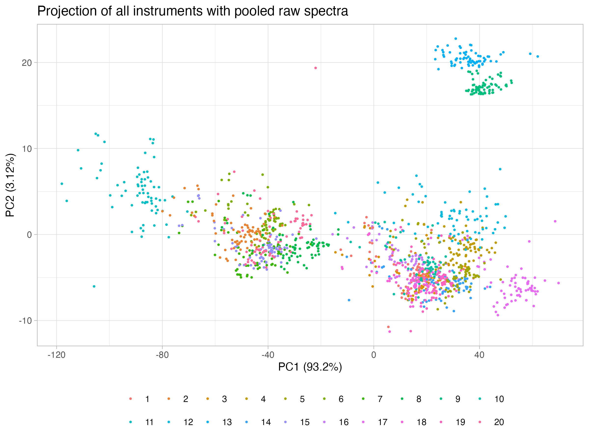
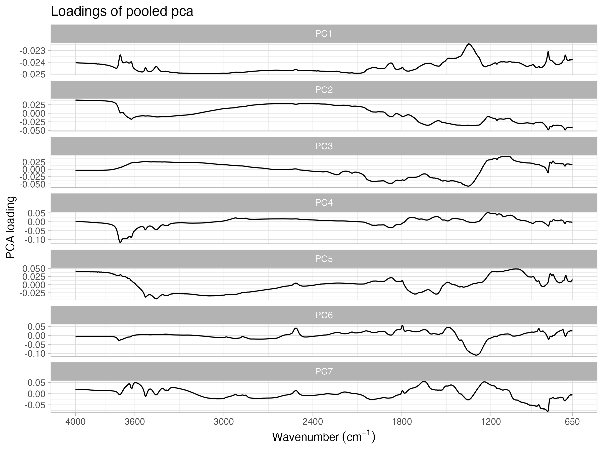

  
```{r setup, include=FALSE}
library("tidyverse")
mnt.dir <- "~/projects/mnt-ringtrial/"
```

## Overview

Inter-laboratory comparison of soil spectral measurements as part of the SoilSpec4GG project.

This repository is used for analyzing the metadata of different instruments of the ring trial.

The workspace development is defined by:

- GitHub repository: [soilspectroscopy/ringtrial-metadata](https://github.com/soilspectroscopy/ringtrial-metadata).
- Google Cloud storage for efficient file storage and access: [whrc.org/soilcarbon-soilspec/storage/sc-ringtrial](https://console.cloud.google.com/storage/browser/sc-ringtrial).

## Metadata

Similar levels were grouped to a common format. All strings starts with upper case in the first letter. Spaces are replaced with dash.

The following information was prepared:

- Manufacturer: the instrument's manufacturer. Only spaces replaced with dash.  
- Model: the instrument's model. Several levels are provided, so model number was omitted to group the variation to a common model. Spaces replaced with dash.  
- Year: year the instrument was built. No modification.  
- Beamsplitter: The crystal used to split the beam for generating the interferogram. Some proprietary materials have some coatings but they were placed under the same basic material.  
- Detector: The beam detector that is part of the interferogram. Again, some variations were placed under the same basic type.  
- Mirror: mirror material as part of the interferogram..  
- Accessory: scanning accessory for DRIFT. Manufacturer and accessory name is provided. Names formatted to a common string
- Background: material used as reference for internal calibration.  
- Sample presentation: soil sample presentation (in the accessory) before scanning.  
- Neat/Mulled: additional sample preparation. Mulled = mixed with a compound to form a paste. Neat = unmixed.  
- Purged: internal gas cleaning before scanning.  

Prepared metadata:
```{r metadata, message=F, warning=F, echo=F}
read_csv("outputs/instruments_metadata_clean.csv") %>%
  knitr::kable()
```

## Pooled PCA

Pooled PCA was performend to retain 99.5% of the original variance. This resulted in 7 components.





## Spectral clustering analysis


## Contingency analysis

